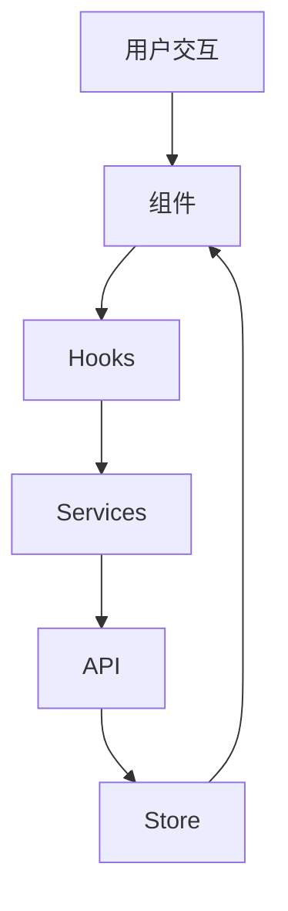

# 架构设计文档

## 系统架构概览

### 1. 前端架构

```
Atom-Stats
├── 展示层 (Presentation)
│   ├── 页面组件 (Pages)
│   ├── 布局组件 (Layouts)
│   └── UI组件 (Components)
├── 业务层 (Business)
│   ├── Hooks
│   ├── Services
│   └── Utils
├── 状态管理 (State)
│   ├── Store
│   └── Context
└── 基础设施 (Infrastructure)
    ├── API Client
    ├── Router
    └── Storage
```

### 2. 数据流图



## 核心模块设计

### 1. 统计引擎模块

#### 职责
- 代码分析计算
- 语言识别
- 统计聚合
- 数据缓存

#### 关键接口
```typescript
interface CodeAnalyzer {
  analyze(path: string): Promise<AnalysisResult>;
  getLanguageStats(): LanguageStats;
  getComplexityMetrics(): ComplexityMetrics;
}
```

### 2. Git 集成模块

#### 职责
- 仓库连接
- 提交分析
- 分支管理
- 变更追踪

#### 关键接口
```typescript
interface GitAnalyzer {
  connect(repo: string): Promise<void>;
  getCommitHistory(): Promise<CommitHistory>;
  getBranchStats(): Promise<BranchStats>;
  getContributorStats(): Promise<ContributorStats>;
}
```

### 3. 可视化模块

#### 职责
- 数据转换
- 图表渲染
- 交互处理
- 主题适配

#### 关键组件
```typescript
interface ChartProps {
  data: any[];
  config: ChartConfig;
  theme: ThemeType;
  interactions?: Interaction[];
}
```

## 技术选型考虑

### 1. 前端框架
- **React**: 组件化开发，生态完善
- **TypeScript**: 类型安全，开发效率
- **Vite**: 快速的开发体验

### 2. 状态管理
- **Zustand**: 轻量级，易于使用
- **Context**: 轻量级状态共享

### 3. 样式方案
- **Tailwind CSS**: 原子化CSS，开发效率
- **CSS Modules**: 样式隔离

### 4. 工具库
- **Recharts**: 图表可视化
- **Axios**: 网络请求
- **date-fns**: 日期处理

## 性能优化策略

### 1. 代码分割
```typescript
// 路由级别代码分割
const CodeAnalysis = lazy(() => import('./pages/CodeAnalysis'));
const TeamAnalysis = lazy(() => import('./pages/TeamAnalysis'));
```

### 2. 资源优化
- 图片懒加载
- 组件懒加载
- 预加载关键资源

### 3. 缓存策略
- API 响应缓存
- 分析结果缓存
- 静态资源缓存

## 扩展性设计

### 1. 插件系统
```typescript
interface Plugin {
  name: string;
  version: string;
  activate(): void;
  deactivate(): void;
}
```

### 2. 主题系统
```typescript
interface Theme {
  colors: ColorPalette;
  typography: Typography;
  spacing: Spacing;
}
```

### 3. 国际化
```typescript
interface I18nProvider {
  translate(key: string, params?: object): string;
  changeLanguage(lang: string): void;
}
```

## 安全性考虑

### 1. 数据安全
- 敏感信息加密
- 权限控制
- 数据验证

### 2. 代码安全
- 依赖审查
- XSS 防护
- CSRF 防护

## 监控和日志

### 1. 性能监控
```typescript
interface PerformanceMetrics {
  responseTime: number;
  memoryUsage: number;
  cpuUsage: number;
}
```

### 2. 错误追踪
```typescript
interface ErrorTracker {
  captureError(error: Error): void;
  captureMessage(message: string): void;
}
```

## 部署架构

### 1. 开发环境
- 本地开发服务器
- Mock 数据服务
- 热更新支持

### 2. 生产环境
- CDN 分发
- 静态资源优化
- 错误监控