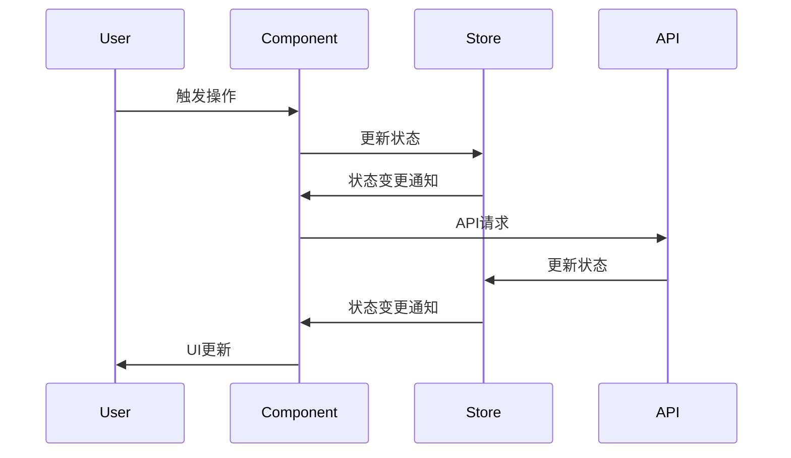

# 数据流设计

## 状态管理架构

### 1. 全局状态层级
```typescript
interface RootState {
  app: AppState;         // 应用级状态
  project: ProjectState; // 项目级状态
  analysis: AnalysisState; // 分析数据状态
  user: UserState;      // 用户状态
}

interface AppState {
  theme: 'light' | 'dark' | 'system';
  locale: string;
  loading: boolean;
  error: Error | null;
}

interface ProjectState {
  currentProject: Project | null;
  projectList: Project[];
  analysisStatus: 'idle' | 'analyzing' | 'complete' | 'error';
}

interface AnalysisState {
  codeStats: CodeStats;
  gitStats: GitStats;
  teamStats: TeamStats;
  cacheTimestamp: number;
}
```

### 2. Store 设计
```typescript
// 应用状态管理
const useAppStore = create<AppState & AppActions>((set) => ({
  theme: 'system',
  locale: 'zh-CN',
  loading: false,
  error: null,
  setTheme: (theme) => set({ theme }),
  setLocale: (locale) => set({ locale }),
  setLoading: (loading) => set({ loading }),
  setError: (error) => set({ error }),
}));

// 项目状态管理
const useProjectStore = create<ProjectState & ProjectActions>((set) => ({
  currentProject: null,
  projectList: [],
  analysisStatus: 'idle',
  setCurrentProject: (project) => set({ currentProject: project }),
  updateProjectList: (projects) => set({ projectList: projects }),
  setAnalysisStatus: (status) => set({ analysisStatus: status }),
}));
```

## 数据流转

### 1. 用户交互流程


### 2. 数据更新策略
```typescript
// 乐观更新示例
const updateProject = async (projectId: string, data: Partial<Project>) => {
  // 1. 立即更新UI
  useProjectStore.setState((state) => ({
    projectList: state.projectList.map((p) =>
      p.id === projectId ? { ...p, ...data } : p
    ),
  }));

  try {
    // 2. 发送API请求
    await updateProjectAPI(projectId, data);
  } catch (error) {
    // 3. 错误时回滚
    useProjectStore.setState((state) => ({
      projectList: state.projectList.map((p) =>
        p.id === projectId ? { ...p, ...previousData } : p
      ),
    }));
  }
};
```

## 数据缓存策略

### 1. API 响应缓存
```typescript
interface CacheConfig {
  ttl: number;          // 缓存有效期
  maxSize: number;      // 最大缓存条目
  invalidationRules: {  // 缓存失效规则
    onAction: string[];
    onPathChange: string[];
  };
}

const apiCache = new APICache({
  ttl: 5 * 60 * 1000,  // 5分钟
  maxSize: 100,
  invalidationRules: {
    onAction: ['updateProject', 'deleteProject'],
    onPathChange: ['/projects', '/analysis'],
  },
});
```

### 2. 状态持久化
```typescript
interface PersistConfig {
  key: string;
  storage: Storage;
  whitelist: string[];
  version: number;
}

const persistConfig: PersistConfig = {
  key: 'atom-stats',
  storage: localStorage,
  whitelist: ['app', 'user'],
  version: 1,
};

const persistMiddleware = (config: PersistConfig) => 
  (set, get, api) =>
    (...args) => {
      set(...args);
      const state = get();
      const persistedState = config.whitelist.reduce(
        (acc, key) => ({ ...acc, [key]: state[key] }),
        {}
      );
      config.storage.setItem(
        config.key,
        JSON.stringify({ version: config.version, state: persistedState })
      );
    };
```

## 数据同步机制

### 1. 实时更新
```typescript
interface WebSocketMessage {
  type: 'update' | 'delete' | 'create';
  payload: any;
  timestamp: number;
}

const setupWebSocket = () => {
  const ws = new WebSocket(WS_URL);
  
  ws.onmessage = (event) => {
    const message: WebSocketMessage = JSON.parse(event.data);
    switch (message.type) {
      case 'update':
        handleUpdate(message.payload);
        break;
      case 'delete':
        handleDelete(message.payload);
        break;
      case 'create':
        handleCreate(message.payload);
        break;
    }
  };
};
```

### 2. 定时同步
```typescript
interface SyncConfig {
  interval: number;     // 同步间隔
  retryAttempts: number; // 重试次数
  onSync: () => Promise<void>;
}

const setupSync = (config: SyncConfig) => {
  let attempts = 0;
  
  const sync = async () => {
    try {
      await config.onSync();
      attempts = 0;
    } catch (error) {
      if (attempts < config.retryAttempts) {
        attempts++;
        setTimeout(sync, Math.pow(2, attempts) * 1000);
      }
    }
  };
  
  setInterval(sync, config.interval);
};
```

## 错误处理

### 1. 全局错误处理
```typescript
interface ErrorState {
  message: string;
  code: string;
  stack?: string;
  timestamp: number;
}

const errorMiddleware = (set, get) => (action) => {
  try {
    return action(set, get);
  } catch (error) {
    set((state) => ({
      error: {
        message: error.message,
        code: error.code,
        stack: process.env.NODE_ENV === 'development' ? error.stack : undefined,
        timestamp: Date.now(),
      },
    }));
  }
};
```

### 2. API 错误处理
```typescript
interface APIError extends Error {
  code: string;
  details?: Record<string, any>;
}

const handleAPIError = (error: APIError) => {
  switch (error.code) {
    case 'UNAUTHORIZED':
      useAppStore.getState().logout();
      break;
    case 'RATE_LIMIT':
      useAppStore.getState().showRateLimitError();
      break;
    default:
      useAppStore.getState().setError(error);
  }
};
```

## 性能优化

### 1. 选择器优化
```typescript
const selectFilteredProjects = (state: RootState) => {
  const { projectList } = state.project;
  const { searchTerm, filters } = state.app;
  
  return useMemo(
    () => projectList.filter(project => 
      project.name.includes(searchTerm) &&
      filters.every(filter => filter(project))
    ),
    [projectList, searchTerm, filters]
  );
};
```

### 2. 批量更新优化
```typescript
const batchUpdate = (updates: Array<Update>) => {
  useProjectStore.setState((state) => {
    const newState = { ...state };
    updates.forEach(update => {
      // 应用更新
      applyUpdate(newState, update);
    });
    return newState;
  });
};
```