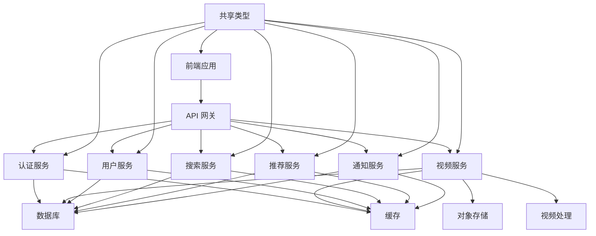
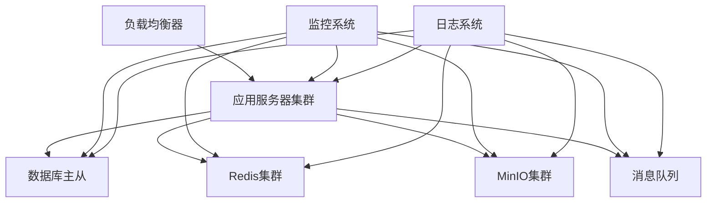

# 系统架构文档

## 1. 系统概述

Atom-Video 是一个基于现代 Web 技术的视频分享平台，采用 Monorepo 架构设计。系统旨在提供高性能、可扩展的视频服务，同时保证良好的用户体验。

## 2. 技术栈

### 2.1 前端技术栈
- Vue 3 + TypeScript
- Tailwind CSS
- Pinia 状态管理
- Vue Router
- Axios HTTP 客户端
- Font Awesome 图标库

### 2.2 后端技术栈
- Node.js + Express
- TypeScript
- Prisma ORM
- PostgreSQL 数据库
- Redis 缓存
- MinIO 对象存储
- FFmpeg 视频处理

### 2.3 开发工具
- pnpm 包管理器 + Workspace
- ESLint + Prettier 代码规范
- Jest/Vitest 测试框架
- Docker 容器化
- GitHub Actions CI/CD
- Husky + Commitlint Git钩子

## 3. Monorepo 架构

### 3.1 项目结构
```
atom-video/
├── frontend/           # Vue 3 前端项目
├── backend/            # Express.js 后端项目
├── packages/           # 共享包
│   ├── eslint-config/  # 共享ESLint配置
│   ├── shared-types/   # 共享TypeScript类型
│   └── tsconfig/       # 共享TypeScript配置
├── .npmrc              # pnpm 配置
├── package.json        # 工作区配置
└── docs/               # 项目文档
```

### 3.2 共享包详情

#### 3.2.1 @atom/shared-types
负责定义前后端共享的TypeScript类型：
```
shared-types/
├── api/               # API相关类型
│   ├── index.d.ts     # API基础类型
│   ├── user.d.ts      # 用户API类型
│   └── video.d.ts     # 视频API类型
├── models/            # 数据模型类型
│   └── index.d.ts     # 模型基础类型
├── utils/             # 工具类型
│   └── index.d.ts     # 工具函数类型
├── index.d.ts         # 类型导出
└── package.json       # 包配置
```

#### 3.2.2 @atom/eslint-config
提供统一的代码规范配置：
```
eslint-config/
├── index.js           # 基础配置
├── vue.js             # Vue项目配置
├── node.js            # Node.js项目配置
└── package.json       # 包配置
```

#### 3.2.3 @atom/tsconfig
提供共享的TypeScript配置：
```
tsconfig/
├── base.json          # 基础配置
├── vue-app.json       # Vue应用配置
├── node.json          # Node.js应用配置
└── package.json       # 包配置
```

### 3.3 工作区配置

根目录 package.json 定义了工作区和共享脚本：

```json
{
  "name": "atom-video",
  "version": "1.0.0",
  "private": true,
  "type": "module",
  "workspaces": [
    "frontend",
    "backend",
    "packages/*"
  ],
  "scripts": {
    "dev": "pnpm -r --parallel dev",
    "dev:frontend": "pnpm --filter frontend dev",
    "dev:backend": "pnpm --filter backend dev",
    "build": "pnpm -r --sequential build",
    "build:frontend": "pnpm --filter frontend build",
    "build:backend": "pnpm --filter backend build",
    "lint": "pnpm -r --parallel lint",
    "test": "pnpm -r test"
  }
}
```

### 3.4 依赖管理

使用 pnpm 进行包管理，主要配置：

```
# .npmrc
engine-strict=true
auto-install-peers=true
shamefully-hoist=true
strict-peer-dependencies=false
shell-emulator=true
node-linker=hoisted
public-hoist-pattern[]=*eslint*
public-hoist-pattern[]=*prettier*
link-workspace-packages=true
```

这些配置确保：
- 工作区包之间可以相互引用
- 常用工具如 ESLint 被提升到根目录
- 依赖安装更加高效

## 4. 系统模块

### 4.1 已完成模块

#### 4.1.1 认证系统
- JWT 认证
- 用户注册/登录
- 密码重置
- 路由守卫

#### 4.1.2 视频功能
- 视频播放器组件
- 多清晰度切换
- 弹幕系统
- 快捷键控制
- 自适应布局
- 主题适配

#### 4.1.3 用户系统
- 用户资料展示
- 用户视频列表
- 关注/取消关注
- 无限滚动加载
- 用户统计

#### 4.1.4 界面系统
- 响应式布局
- 主题切换
- 国际化支持
- 组件库
- 状态管理

### 4.2 进行中模块

#### 4.2.1 视频互动系统
- 评论功能
- 点赞功能
- 收藏功能
- 分享功能
- 弹幕互动

#### 4.2.2 用户设置系统
- 个人资料编辑
- 账号安全设置
- 通知设置
- 隐私设置
- 头像上传

#### 4.2.3 后端API系统
- 用户认证API
- 视频管理API
- 评论系统API
- 用户互动API
- 文件上传API

### 4.3 待开发模块

#### 4.3.1 搜索系统
- 视频搜索
- 用户搜索
- 标签搜索
- 搜索建议

#### 4.3.2 推荐系统
- 基于用户行为的推荐
- 基于内容的推荐
- 热门视频推荐
- 个性化推荐

#### 4.3.3 通知系统
- 系统通知
- 互动通知
- 消息推送
- 通知设置

#### 4.3.4 数据分析
- 用户行为分析
- 视频数据分析
- 系统性能监控
- 数据可视化

## 5. Monorepo 架构的优势

### 5.1 代码共享
- 前后端共享类型定义，确保类型安全
- 共享配置确保代码风格一致
- 通用工具函数可被多个项目使用

### 5.2 开发效率
- 统一的开发工具链
- 简化的依赖管理
- 原子提交支持多包同时更新

### 5.3 统一版本控制
- 所有项目使用相同版本的依赖
- 简化依赖升级过程
- 避免版本不一致导致的问题

### 5.4 简化协作
- 团队成员可以轻松在前后端项目间切换
- 代码规范统一，降低沟通成本
- 集中式文档便于查阅

## 6. 系统优化计划

### 6.1 性能优化
- 数据库优化
- 缓存策略优化
- 文件存储优化
- 视频处理优化

### 6.2 安全性
- 内容审核
- 敏感信息过滤
- 防刷机制
- 安全审计

### 6.3 可扩展性
- 微服务拆分
- 负载均衡
- 服务发现
- 容器化部署

## 7. 运维体系

### 7.1 监控告警
- 系统监控
- 性能监控
- 错误监控
- 告警通知

### 7.2 日志系统
- 访问日志
- 错误日志
- 操作日志
- 日志分析

### 7.3 部署方案
- CI/CD 流程
- 环境配置
- 备份策略
- 容灾方案

## 8. 开发进度

### 8.1 已完成功能
- 基础认证系统
- 视频上传和播放
- 用户管理
- 视频互动功能
- 缓存系统
- Monorepo架构搭建
- 共享类型定义

### 8.2 进行中功能
- 搜索系统开发
- 推荐系统设计
- 通知系统实现
- 数据分析平台

### 8.3 待开发功能
- 高级搜索功能
- 个性化推荐
- 实时通知
- 数据可视化

## 9. 下一步计划

1. 完善共享包的类型定义
2. 实现搜索系统，提升用户体验
3. 开发推荐系统，增加用户粘性
4. 完善通知系统，提高用户互动
5. 建立数据分析体系，为决策提供支持

## 10. 系统架构图



## 11. 部署架构

