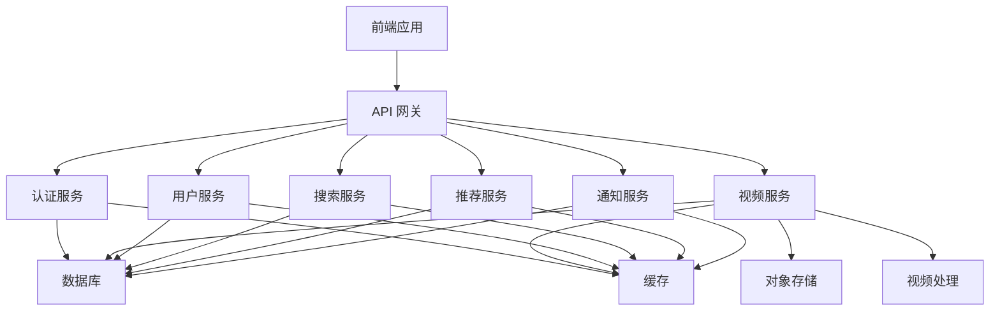
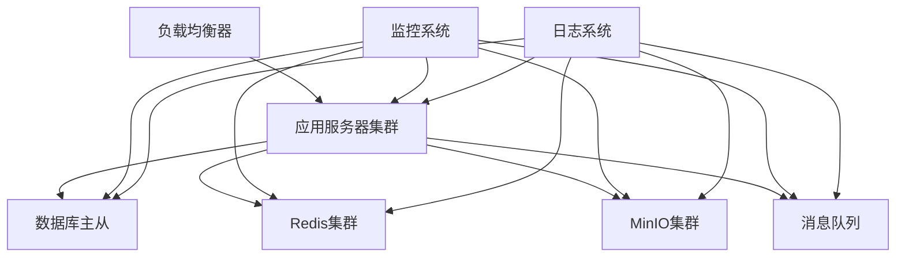

# 系统架构文档

## 1. 系统概述

Atom-Video 是一个基于现代 Web 技术的视频分享平台，采用前后端分离的架构设计。系统旨在提供高性能、可扩展的视频服务，同时保证良好的用户体验。

## 2. 技术栈

### 2.1 前端技术栈
- Vue 3 + TypeScript
- Tailwind CSS
- Pinia 状态管理
- Vue Router
- Axios HTTP 客户端
- Font Awesome 图标库

### 2.2 后端技术栈
- Node.js + Express
- TypeScript
- Prisma ORM
- PostgreSQL 数据库
- Redis 缓存
- MinIO 对象存储
- FFmpeg 视频处理

### 2.3 开发工具
- pnpm 包管理器
- ESLint + Prettier 代码规范
- Jest 测试框架
- Docker 容器化
- GitHub Actions CI/CD

## 3. 系统模块

### 3.1 已完成模块

#### 3.1.1 认证系统
- JWT 认证
- 用户注册/登录
- 密码重置
- 路由守卫

#### 3.1.2 视频功能
- 视频上传
- 视频处理（FFmpeg）
- 视频存储（MinIO）
- 视频播放
- 视频互动（点赞、收藏、评论）

#### 3.1.3 用户系统
- 用户管理
- 用户关系（关注/粉丝）
- 用户统计

#### 3.1.4 缓存系统
- Redis 集成
- 缓存监控
- 缓存清理
- 缓存预热

### 3.2 待开发模块

#### 3.2.1 搜索系统
- 视频搜索
- 用户搜索
- 标签搜索
- 搜索建议

#### 3.2.2 推荐系统
- 基于用户行为的推荐
- 基于内容的推荐
- 热门视频推荐
- 个性化推荐

#### 3.2.3 通知系统
- 系统通知
- 互动通知
- 消息推送
- 通知设置

#### 3.2.4 数据分析
- 用户行为分析
- 视频数据分析
- 系统性能监控
- 数据可视化

## 4. 系统优化计划

### 4.1 性能优化
- 数据库优化
- 缓存策略优化
- 文件存储优化
- 视频处理优化

### 4.2 安全性
- 内容审核
- 敏感信息过滤
- 防刷机制
- 安全审计

### 4.3 可扩展性
- 微服务拆分
- 负载均衡
- 服务发现
- 容器化部署

## 5. 运维体系

### 5.1 监控告警
- 系统监控
- 性能监控
- 错误监控
- 告警通知

### 5.2 日志系统
- 访问日志
- 错误日志
- 操作日志
- 日志分析

### 5.3 部署方案
- CI/CD 流程
- 环境配置
- 备份策略
- 容灾方案

## 6. 开发进度

### 6.1 已完成功能
- 基础认证系统
- 视频上传和播放
- 用户管理
- 视频互动功能
- 缓存系统

### 6.2 进行中功能
- 搜索系统开发
- 推荐系统设计
- 通知系统实现
- 数据分析平台

### 6.3 待开发功能
- 高级搜索功能
- 个性化推荐
- 实时通知
- 数据可视化

## 7. 下一步计划

1. 实现搜索系统，提升用户体验
2. 开发推荐系统，增加用户粘性
3. 完善通知系统，提高用户互动
4. 建立数据分析体系，为决策提供支持

## 8. 系统架构图

## 9. 部署架构

